# ECE 0302 WSL (Ubuntu 22) Setup Instructions
- [Frequently Asked Questions / Issues](https://github.com/jjo527/ECE0302-WSL-Documentation#faq)

## Video version of the instructions: [https://youtu.be/rqA-wuDKynE](https://youtu.be/rqA-wuDKynE)

- Install VS Code on Windows ([link](https://code.visualstudio.com/download))
  - **Note:** do not install VS Code on WSL, only need to install it on Windows
  - Make sure to add it to path on setup
    - 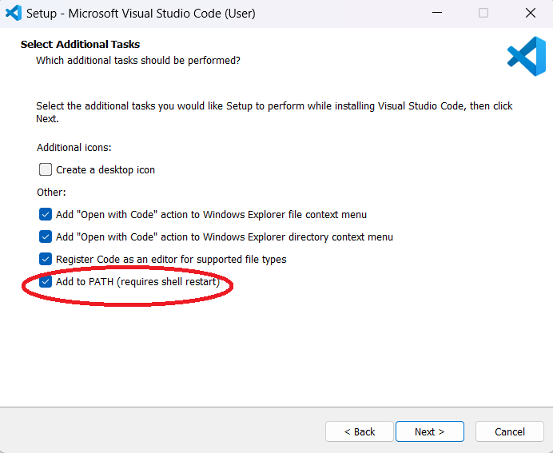
  - Install WSL extension for VS Code ([Managing Extensions in Visual Studio Code](https://code.visualstudio.com/docs/editor/extension-marketplace))
    - 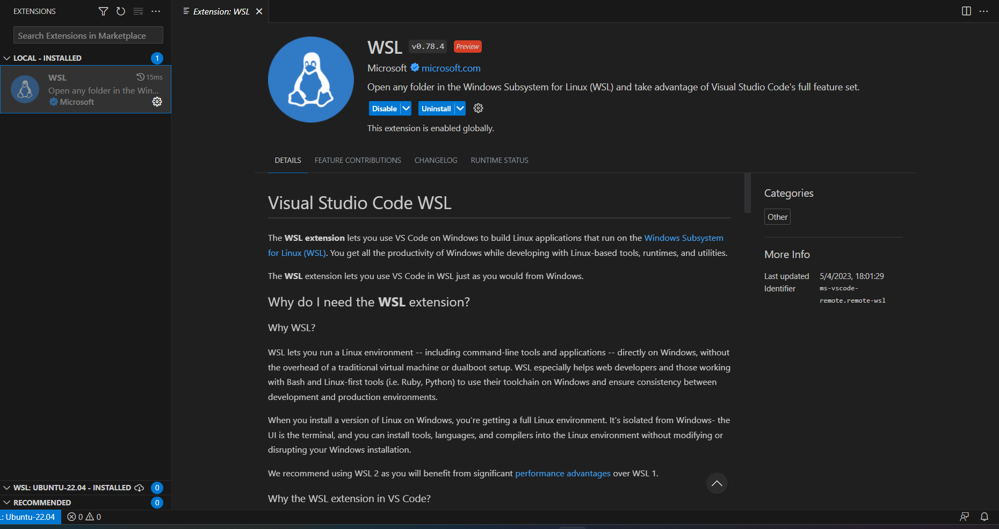
- Microsoft Store Stuff
  - Install WSL2
    - 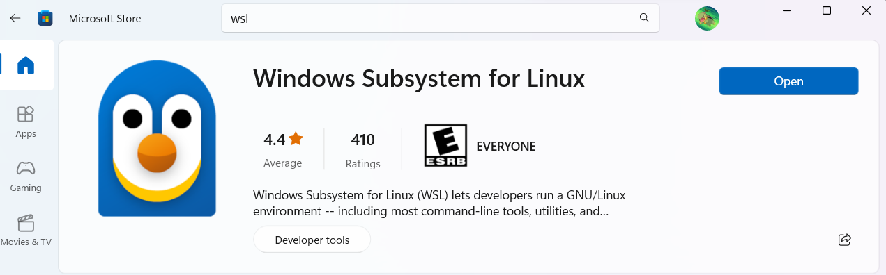
  - Install Ubuntu 22
    - 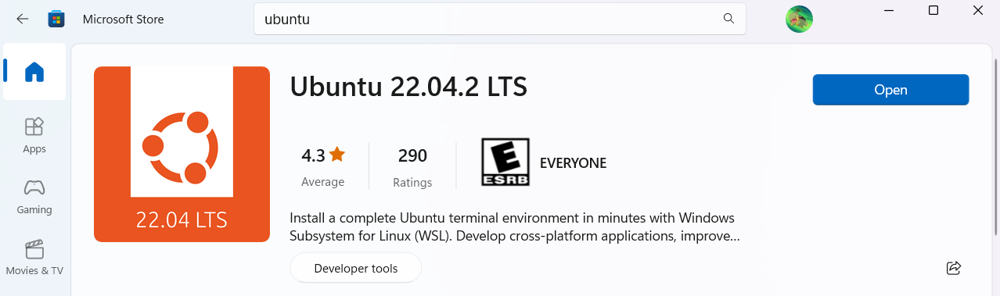
  - Install Windows Terminal
    - 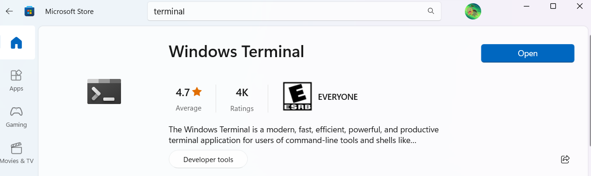
- Make sure WSL is enabled in settings
  - Press Start and Search `Windows Features` ([source](https://superuser.com/questions/1736443/wsl-2-installing-linux-failed-error-code-0x80370114))
  - A window like the one below should open. make sure that the red boxes are checked
  - 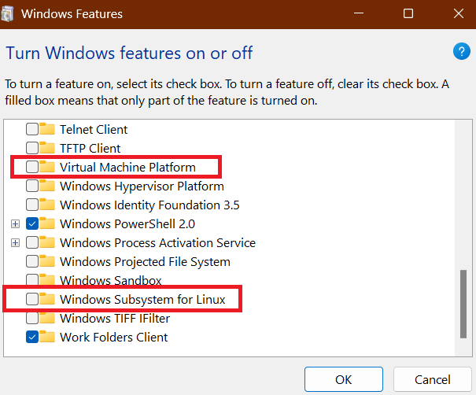
- Initial Ubuntu Setup
  - Should be able to open Ubuntu 22 with Windows terminal now
  - You will need to create a username and password for it
  - It should look something like this when done
    - 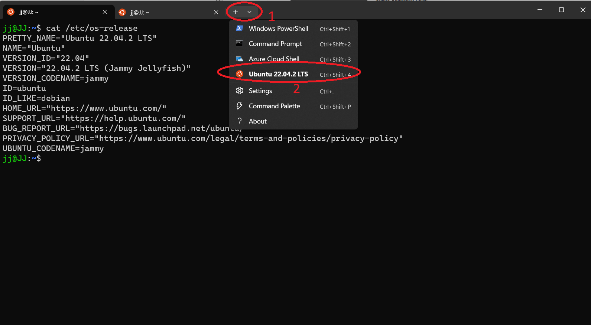
    - The red circles show how you can open a new Ubuntu terminal from Windows terminal
- Install the Compiler & Debugger
  - Run the following commands in an Ubuntu terminal. Purple text will represent terminal commands that you need to run.
  - (Ubuntu) `sudo apt-get update`
  - (Ubuntu) `sudo apt-get install build-essential gdb` ([source](https://code.visualstudio.com/docs/cpp/config-linux))
  - Both the compiler and debugger should return the current version if installed correctly
    - 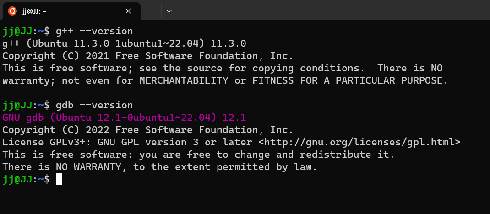
- Install CMake
  - (Ubuntu) `sudo snap install cmake --classic` ([source](https://snapcraft.io/install/cmake/ubuntu))
  - It should look like this if installed correctly
    - 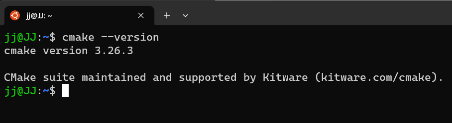
  - Refer to the FAQ at the end of this file if are you having issues installing CMake
- Git is installed by default on Ubuntu 22
  - If it is not installed for some reason, you can install it with the following command:  `sudo apt install git` ([source](https://www.digitalocean.com/community/tutorials/how-to-install-git-on-ubuntu-20-04))
    - 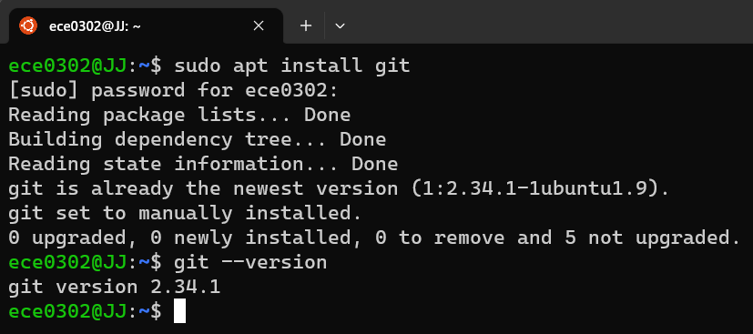
- **(optional)** Other stuff you might want on Ubuntu
  - GUI file explorer
    - (Ubuntu) `sudo apt-get install -y thunar`
    - Can launch with `thunar` anywhere in Ubuntu
    - Will look like this
      - 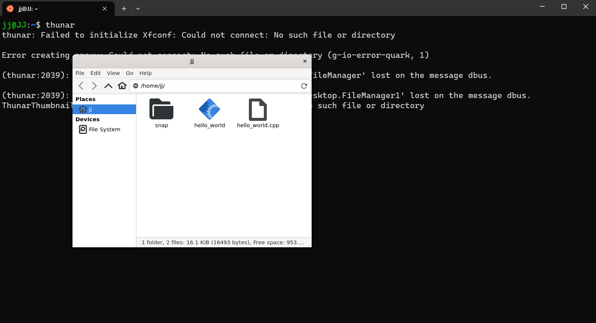
    - You can find your Windows files in the `/mnt/c` directory in Ubuntu
    - **Note:** if thunar or another GUI app on WSL does not seem to be working, then you likely need to update a graphics driver. This can be found on AMD/Intel's websites or via Windows update.
    - You can also access your WSL/Ubuntu files through the regular Windows file explorer.
      - 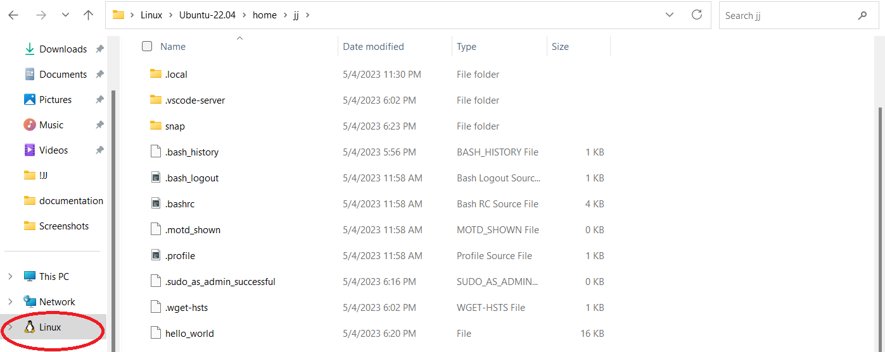
      - `/home/$UBUNTU_USERNAME` is the full path to get to your Ubuntu home. That's `/home/jj` in my case.
  - Web Browser
    - (Ubuntu) `sudo snap install firefox`
    - launch with `firefox` inside of Ubuntu
- Launch VS Code in WSL
  - (Ubuntu) `code .`
    - 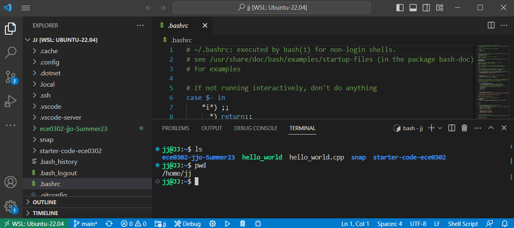
    - Note the WSL: Ubuntu-22.04 at the bottom and the linux terminal. This shows that we opened with our WSL distro and not on Windows
- Install The Following VS Code Extensions:
  - 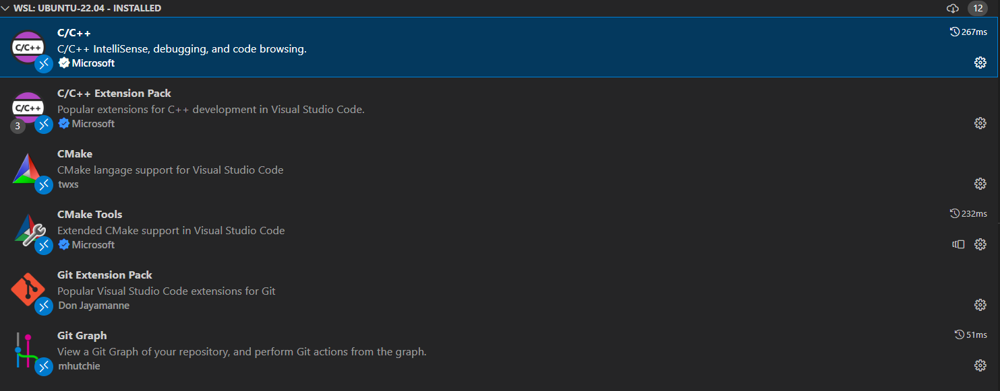
  - **Note:** Any extensions that you already had installed on Windows will need to be installed again on WSL. Follow the same workflow as before when adding extensions.
- You are now setup with WSL/Ubuntu and are good to move onto part 2 of the instructions **"Set Up a Git Repository"**
  - Picture of running Problem 0's tests with WSL and these dependencies
    - 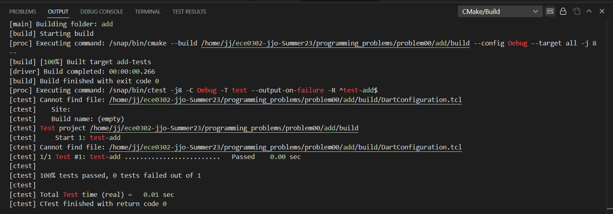
  - Debugger working with this setup
    - 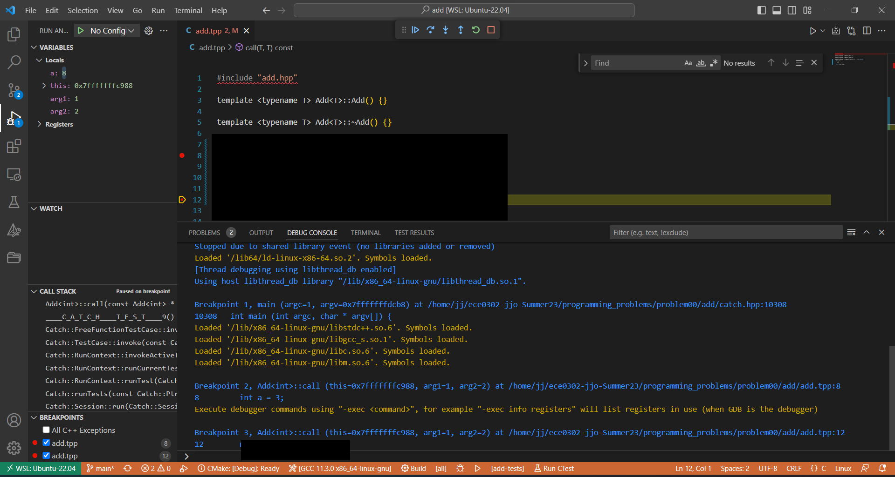

## FAQ

- What is Windows Subsystem for Linux? ([Microsoft Blog post](https://learn.microsoft.com/en-us/windows/wsl/about))
  - It is a Linux virtual machine that integrates very nicely with Windows and offers performance similar to your normal Computer.
- Why develop on Ubuntu instead of Windows for this class?
  - Build tools can be easier to install on Ubuntu.
  - The assignments will be graded on Ubuntu machines, so running on the same OS can help eliminate grading issues down the line.
  - WSL is a great way to get experience with and learn Linux stuff.
  - **Note:** the other setup options are perfectly valid as well. This is just one possible route that is quite promising.
- Why aren't my snap commands working, specifically for CMake?
  - Some users might have issues using snap commands with WSL. [This article](https://devblogs.microsoft.com/commandline/systemd-support-is-now-available-in-wsl/) has more information on getting set up with snap if it's not working out of the box. Normally, this is due to an older Windows or WSL version. Run the following commands in a **PowerShell** terminal (not Ubuntu) to update WSL:
    - (PowerShell) `wsl --update`
    - (PowerShell) `wsl --set-version Ubuntu-22.04 2` ([source](https://learn.microsoft.com/en-us/windows/wsl/install#upgrade-version-from-wsl-1-to-wsl-2))
      - replace Ubuntu-22.04 with your distro's name if using something different
      - can see WSL distros with (PowerShell) `wsl -l -v`
    - (Powershell) `wsl --shutdown`

- VS Code with WSL won't start for some reason
  - 
  - Restart and update WSL
    - (PowerShell) `wsl --update`
    - (PowerShell) `wsl --shutdown`
  - Further action if WSL still won't open
    - refer back to **"Make sure WSL is enabled in settings"** in these instructions (usually the issue)
    - email professor and TAs

- Which compiler am I supposed to use with `CMake: Select a Kit` in VS Code?
  - gcc version 11 (linux-gnu) or later, this was installed during **"Install the Compiler & Debugger"** section of this document
  - 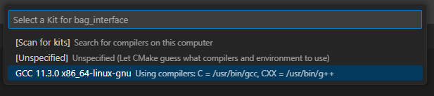
## Additional Resources

- [Using C++ and WSL in VS Code](https://code.visualstudio.com/docs/cpp/config-wsl)
- [Another Video: Visual Studio Code Setup for C/C++ with WSL](https://youtu.be/Hwbii-fnKIk)
- [40 Essential Linux Commands That Every User Should Know](https://www.hostinger.com/tutorials/linux-commands)
